# OS Assignment 2 – fork, Linker & Loader

All working Makefile + explanations

Run:
make         → compile
make run     → execute everything + ldd
## Screenshots of compilation and execution
**required to install gcc : to compile C programs**

**1. outputs**  

**2. Running all programs with make run :**
**Explanation: make run automatically all executions**

**fork() demonstration**
**Linker example**
**Loader example + ldd output showing dynamically loaded libraries**  
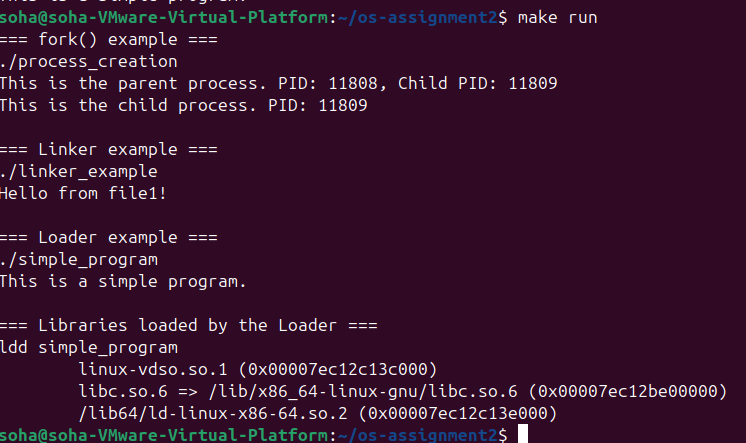

**3. fork() Process Creation and its output** 
**Explanation: The fork() system call creates a child process.**
**Parent receives the child’s PID (> 0)**
**Child receives 0**
**Both processes run the same code and print their own messages.**
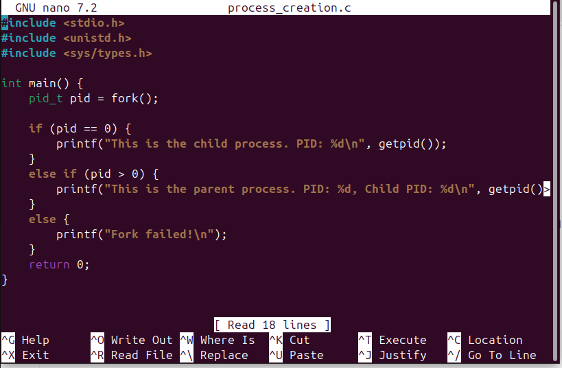  
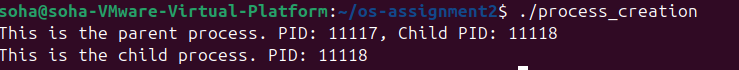

**4. Linker example: that links file1.c and file2.c you will see them linked in the output**
**Explanation:**
**The Linker (called by gcc file1.c file2.c) combines both object files in the output image**
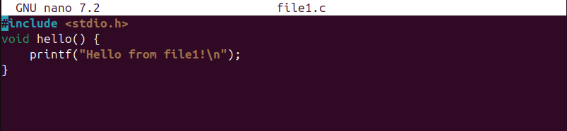
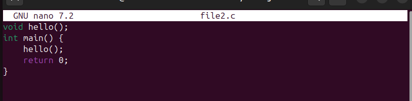

**5. Loader + ldd that list the dynamic libraries**
**Explanation:**
**The program uses** 
**printf("This is a simple program.\n").**
 **When executed, the Loader loads the executable and shared libraries into memory**
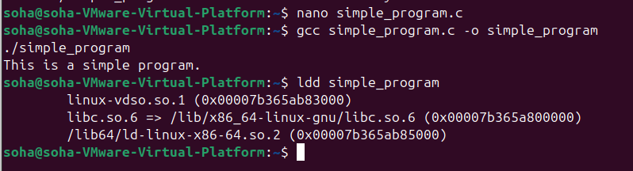

**6. All files : lists all files**  
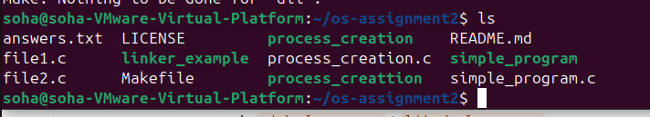

**7.sleep:  Starting Processes in the Background**
**Explanation:**
**sleep 15 & starts the process in the background**
**jobs command lists running background jobs**

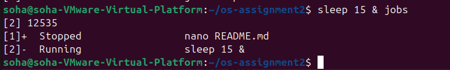

**8.kill : to stop Processes**
**Explanation:**
**ps aux | grep sleep → finds the sleeped process using grep**
    **kill  → terminates the process**
        **kill -STOP  : pauses/suspends the process**
          **kill -CONT  :resumes the paused process**

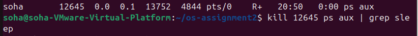
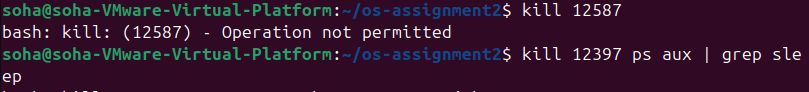
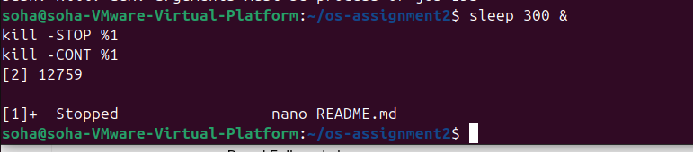

